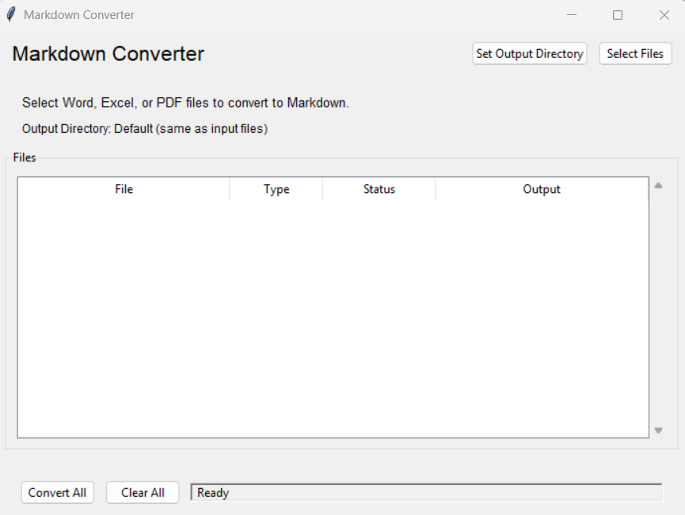

# Markdown Converter GUI

A simple graphical user interface for converting Word, Excel, and PDF files to Markdown using the Microsoft MarkItDown library.



## About This Project

This project is a GUI wrapper for the [Microsoft MarkItDown](https://github.com/microsoft/markitdown) library. It provides an easy-to-use interface for converting various document formats to Markdown without requiring command-line knowledge. The application was developed to simplify the process of converting multiple files and saving them to a destination directory of your choice.

## Features

- **Easy File Selection**: Choose Word (.docx), Excel (.xlsx/.xls), or PDF (.pdf) files for conversion
- **Custom Output Directory**: Set a single destination folder for all converted files
- **Batch Processing**: Add multiple files and convert them all at once
- **Status Tracking**: Monitor the progress and status of each file (Pending, Converting, Completed, Failed)
- **Context Menu**: Right-click on files to:
  - Open the generated Markdown file
  - Open the folder containing the file
  - Remove the file from the list

## Requirements

- Python 3.6 or higher
- tkinter library (usually included with Python)
- Microsoft MarkItDown library with appropriate features

## Installation

1. Ensure Python is installed on your computer
2. Install the required dependencies:
   ```
   pip install "markitdown[pdf,docx,xlsx]"
   ```
   Or to install all features:
   ```
   pip install "markitdown[all]"
   ```

## Usage

1. Run the script:
   ```
   python markitdown_converter_gui.py
   ```

2. Click "Select Files" to choose files for conversion

3. (Optional) Click "Set Output Directory" to specify a directory where all Markdown files will be saved

4. Click "Convert All" to start the conversion process

5. Markdown files will be saved in the selected output directory (or in the same directory as the original files if no output directory is specified)

## Windows Execution

To make running the application easier on Windows, you can create a .bat file with the following content:

```bat
@echo off
C:\Path\To\Python\python.exe C:\Path\To\markitdown_converter_gui.py
pause
```

Replace the paths with the correct paths on your system.

## Troubleshooting

- **Missing Dependencies**: If you receive errors about missing libraries, install the required dependencies using pip as shown above
- **Conversion Failures**: Make sure you're using the latest version of the MarkItDown library
- **Unsupported Files**: The application only supports .docx, .xlsx, .xls, and .pdf files

## Contributing

Contributions are welcome! If you'd like to improve this tool:

1. Fork the repository
2. Create a new branch for your feature
3. Add your changes
4. Submit a pull request

## Credits

This application is built on top of the [Microsoft MarkItDown](https://github.com/microsoft/markitdown) library, which is the core conversion engine. All document conversion functionality is provided by this underlying library.

- **MarkItDown Library**: © Microsoft Corporation
- **GUI Application**: Free to use, modify, and distribute

## License

This project is licensed under the MIT License - see the [Microsoft MarkItDown LICENSE](https://github.com/microsoft/markitdown/blob/main/LICENSE) file for details.